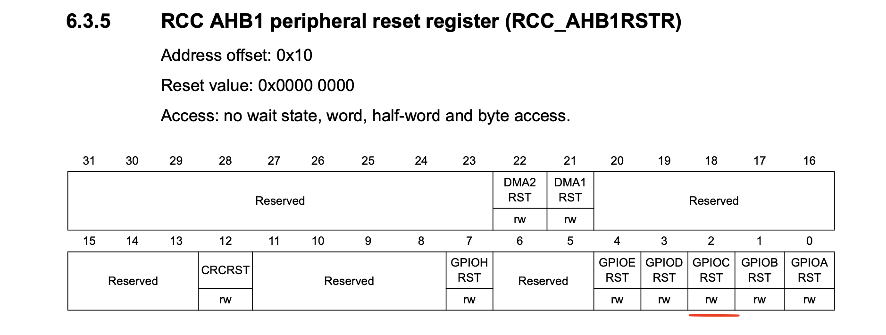
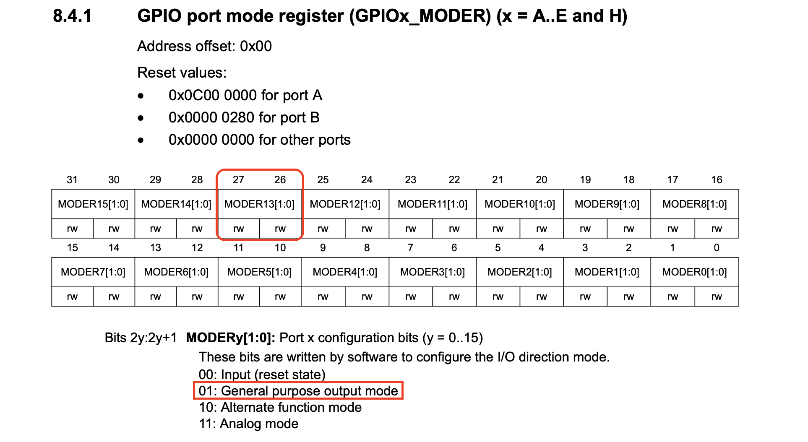

# STM32F4 Baremetal: Create a separate startup script

<!--toc:start-->

- [STM32F4 Baremetal: Create a separate startup script](#stm32f4-baremetal-create-a-separate-startup-script)
  - [Tools Setup](#tools-setup)
  - [Project Structure](#project-structure)
  - [Memory map](#memory-map)
  - [Boot sequence of MCU](#boot-sequence-of-mcu)
    - [Vector table](#vector-table)
    - [Reset handler](#reset-handler)
  - [Registers](#registers)
    - [RCC](#rcc)
    - [GPIO](#gpio)
    - [Blinking](#blinking)
  - [Building](#building)
    - [Compilation](#compilation)
    - [Generate binary from executable](#generate-binary-from-executable)
    - [Flashing](#flashing)
  - [Output](#output)
  <!--toc:end-->

[](https://opensource.org/licenses/)

This guide is meant for embedded developers who wish to get the know how of flow of embedded systems developement. This guide dives in detail about programming embedded sysetems using only the bare-minimum tools mentioned below

1. arm-none-eabi-gcc - Cross Compiler for Arm Cortex M systems
2. Datasheet for target micro-controller
3. Text editor
4. ST Link - Programmer to flash the binary on the board

In this second step. we strip the startup code from the `main.c` file and create a separate startup script.

## Tools Setup

1. GNU toolchain

   - for debian based systems:

   ```bash
   sudo apt install build-essential
   ```

   - for Mac OS

   ```bash
   brew install gcc-arm-embedded
   ```

2. ST Link drivers

   - for debian based systems

   ```bash
   sudo apt install stlink-tools
   ```

   - for Mac OS

   ```bash
   brew install stlink
   ```

## Project Structure

1. `src/main.c`\
   The main function for the application, separated from the startup code. initializes the peripherals and infinitely blinks the LED.
2. `src/startup_stm32f4.c`\
   The startup script for the micro-controller, stripped from `src/main.c`.
3. `stm32f4.ld`\
   This is the linker script required by the linker to create the binary in the layout required by the micro-controller.

## Memory map

The micro-controller has two types of memory i.e. Flash and SRAM. The micro-controller used for this program has 64KB of SRAM and 264KB of Flash. Both the memories are mapped in the same address space as shown in the following image:
The program binary is also divided into multiple regions called as sections. These sections should be put in appropriate memory type, this is done by linker with the help from the linker script. The following snippet shows the memory segments and sections mapped to the memory segments

```c
MEMORY
{
    FLASH(rx):    ORIGIN = 0x08000000,    LENGTH =256K
    SRAM(rwx):    ORIGIN = 0x20000000,    LENGTH =64K
}

_estack = ORIGIN(SRAM) + LENGTH(SRAM);

SECTIONS
{
    .isr_vector :
    {
        . = ALIGN(4);
        KEEP(*(.isr_vector)) /* Startup code */
        . = ALIGN(4);
    } >FLASH

    .text :
    {
        . = ALIGN(4);
        *(.text)           /* .text sections (code) */
        *(.text*)          /* .text* sections (code) */
        . = ALIGN(4);
    } >FLASH
}
```

From the above snippet it is understood that the `.text` section is mapped to _FLASH_ memory region. The size of _FLASH_ is 64KB and its address range starts from `0x2000000`;

## Boot sequence of MCU

When an Arm micro-controller boots it reads the stack pointer value as the first word and vector table from the subsequent memory locations. The first 16 entries in this table are reserved by ARM and next entries depend upon the MCU vendor.
Every entry in this table is a pointer to the function acting as a handler for the respective interrupt. When an intrrupt occurs the respective function is excuted as a part of interrupt handling sequence.
For our program we only need one inttrupt handler i.e. Reset Handler.

### Vector table

The following snippet shows the setting of stack pointer and reset handler.

```C
void (*vectors[16 + 52])(void) __attribute__((section(".isr_vector"))) = {
    _estack,
    Reset_Handler,
};

```

Here `vectors` is an array of function pointer which is decorated with a compiler attribute called `section`. This will place this array in a separate section named `.isr_vector`. The linker file ensures that this is placed at the first memory location in the _FLASH_.
The first entry in the array (vector table) is the value of stack pointer which is defined in linker file and second entry is the address of out reset handler.

### Reset handler

After setting up the stack the control jumps to the Reset*Handler. We copy the `.data` section from \_FLASH* to _SRAM_ and initializes the `.bss` section. We call the `main()` function next and fall into infinite loop if it fails.

## Registers

We need to configure only 3 registers to blink the onboard LED connected to pin C13. To access those registers we have defined a structure each for the _RCC (Reset and Clock Control)_ & _GPIO_ peripherals according to the datasheet. The individual registers in those peripherals are accessed as pointers.

### RCC

We need to enable the clock on the GPIO port in order to modify its registers. Without this any modification done to its registers have no effect.

```C
RCC->AHB1ENR |= 1 << 2;
```

In above snippet, we are setting the 2nd bit in the `AHB1ENR` register as PORTC is connected to _APB1_ bus and the bit number is calculated according to the datasheet.



### GPIO

We have to configure the pin 13 on GPIO port C in output mode as follows.



As per the datasheet we set the _Bit 26_ of the `MODER` register to configure Pin13 in output mode. First we clear the bits 26 & 27 to reset any default configuration and then set bits according to the datasheet.

```C
GPIOC->MODER &= ~ 3U  << (13 * 2);  // clear previous configuration
GPIOC->MODER |= (GPIO_MODE_OUTPUT & 3U) << (13 * 2);   // Set new mode
```

### Blinking

TO blink the LED we have to write 1 & 0 to the pin with some delay in between. To achieve this we have added helper functions as follows:

```C
static inline void gpio_set(struct gpio* port, uint32_t pin){
    port->BSRR |= 1 << pin;
}

static inline void gpio_reset(struct gpio* port, uint32_t pin){
    port->BSRR |= 1 << (pin + 16);
}
```

## Building

This step involves compiling the source file separately and linking the relocatable object files to generate the final executable object file. In the next step the executable object file is converted into the binary format understood by the micro-controller.

### Compilation

Run the following command to compile the `main.c` file and generate executable.

```bash
arm-none-eabi-gcc -mcpu=cortex-m4 -mfloat-abi=soft -mthumb -nostartfiles -nostdlib -o src/main.o -c src/main.c
arm-none-eabi-gcc -mcpu=cortex-m4 -mfloat-abi=soft -mthumb -nostartfiles -nostdlib -o src/startup_stm32f4.o -c src/startup_stm32f4.c
arm-none-eabi-gcc -mcpu=cortex-m4 -mfloat-abi=soft -mthumb -nostartfiles -nostdlib -o blink.elf src/main.o src/startup_stm32f4.o -Tstm32f4.ld
```

Flags:

1. `-mcpu=cortex-m4`\
   Specifies the target cpu type
2. `-mfloat-abi=soft`\
   Specifies FPU settings (Use software floating point unit)
3. `-mthumb`\
   Specifies to use the _THUMB2_ instruction set
4. `-nostartfiles -nostdlib`\
   Instructs compiler not to link standard libraries
5. `-Tstm32f4.ld`\
   Specifies the linker script for the linker

### Generate binary from executable

The above command generates an _ELF_ file which is not suitable for flashing to micro-controller, so in the next step we convert the _ELF_ file into the _BINARY_ image required for flashing.

```bash
arm-none-eabi-objcopy -Obinary blink.elf blink.bin
```

### Flashing

In the final step we flash the generated binary image to the micro-controller.

```bash
st-flash --connect-under-reset write blink.bin 0x8000000
```

This command flashes the binary image at address `0x8000000` as the _FLASH_ memory starts from that address.

## Output

After flashing successfully the LED should be Blinking.
